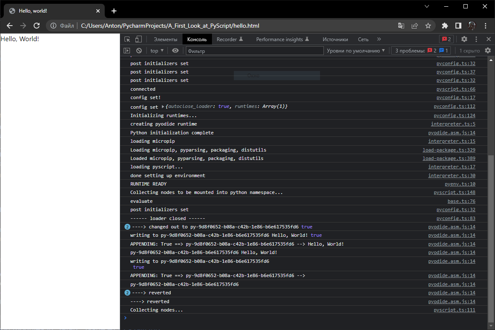
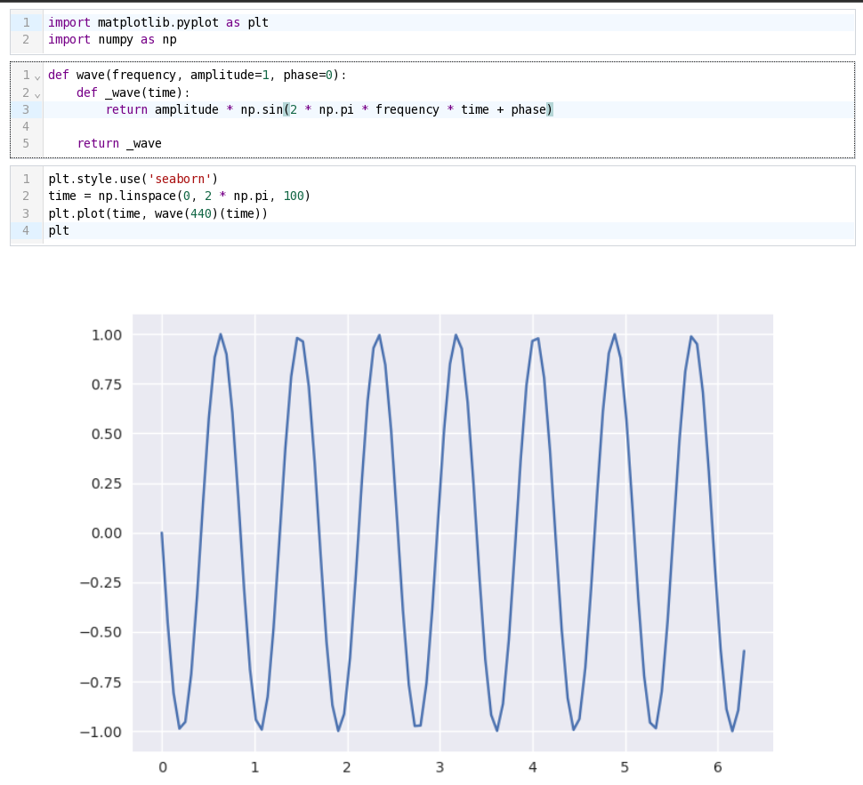
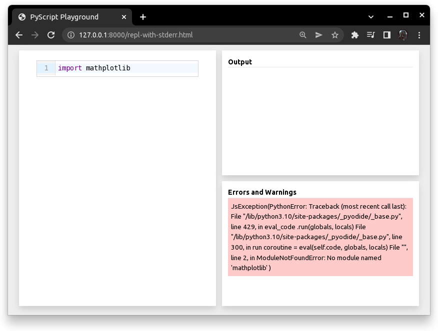

[A First Look at PyScript: Python in the Web Browser by Bartosz Zaczyński](https://realpython.com/pyscript-python-in-browser/)

# Напишите свое первое «Hello, World!» в PyScript

Самый быстрый способ начать работу с PyScript — создать документ HTML5, 
сохранить его в локальном файле, таком как hello.html, и использовать 
два необходимых файла, размещенных на домашней странице PyScript:

```HTML
<!DOCTYPE html>
<html lang="en">
<head>
    <meta charset="UTF-8">
    <meta name="viewport" content="width=device-width, initial-scale=1">
    <title>Hello, world!</title>
    <!-- PyScript source -->
    <link rel="stylesheet" href="https://pyscript.net/alpha/pyscript.css" />
    <script defer src="https://pyscript.net/alpha/pyscript.js"></script>
</head>
<body>
    <py-script>print('Hello, World!')</py-script>
</body>
</html>
```
Первый файл `pyscript.css` содержит стили по умолчанию для визуальных 
компонентов PyScript, а также заставку загрузчика.

Второй файл `pyscript.js` - это JavaScript, содержащий Python и 
пользовательские элементы, такие как `<py-script>`, которые могут 
выключать в себя код Python.

При такой настройке вам *не нужно* запускать веб-сервер для доступа к 
вашему HTML-контенту. Сохраните документ и откройте его в браузере.



Поздравляем! Вы только что создали свое первое приложение PyScript, которое 
будет работать в любом современном веб-браузере, даже на ранних моделях 
Chromebook, без необходимости установки интерпретатора Python. 

Вы можете буквально скопировать свой HTML-файл на флэш-накопитель USB и 
передать его другу, и он сможет запустить ваш код, даже если на его 
компьютере не установлен Python.

# Загрузка среды Python из Интернета

Когда вы открываете HTML-файл в веб-браузере, загрузка занимает несколько 
секунд, прежде чем отобразится `Hello, World!` в окне. PyScript должен 
получить дюжину дополнительных ресурсов из jsDelivr CDN. 

Эти ресурсы составляют среду Pyodide, которая в несжатом виде весит более 
двадцати мегабайт.

К счастью, ваш браузер будет 
[кэшировать большинство](https://pressidium.com/blog/browser-cache-work/) 
этих ресурсов в памяти или на диске, так что в будущем время загрузки будет 
заметно быстрее. Если вы открыли свой HTML-файл хотя бы один раз, то сможете 
работать в **автономном режиме**, не завися от подключения.

Полагаться на CDN для доставки ваших зависимостей, несомненно, удобно, но 
иногда это ненадежно. В прошлом были известны случаи выхода CDN из строя, 
что приводило к перебоям в работе крупных онлайн-компаний. 

Поскольку PyScript находится на передовой, CDN всегда обслуживает последнюю 
альфа-сборку, которая иногда может приводить к критическим изменениям. И наоборот, 
CDN иногда может потребоваться время, чтобы не отставать от GitHub, поэтому он 
может обслуживать устаревший код.

Не лучше ли всегда запрашивать конкретную версию PyScript?

# Скачать PyScript для автономной разработки

Если вы не хотите полагаться на службу хостинга PyScript, вам нужно загрузить все 
файлы, необходимые для запуска Python в браузере, и разместить их самостоятельно. 
В целях разработки вы можете запустить локальный HTTP-сервер, встроенный прямо в 
Python, введя следующую команду в каталоге с вашими файлами для размещения:

```shell
$ python -m http.server
Serving HTTP on 0.0.0.0 port 8000 (http://0.0.0.0:8000/) ...
```

По умолчанию он запускает сервер, прослушивающий HTTP-запросы на всех сетевых интерфейсах, 
включая `localhost` и номер порта `8000`. При необходимости вы можете настроить как адрес, 
так и номер порта с дополнительными аргументами. Это позволит вам получить доступ к вашему 
приложению PyScript, например, по адресу **http://localhost:8000/hello.html**.

Однако, прежде чем вы сможете это сделать, вам необходимо загрузить `pyscript.css`, `pyscript.js` 
и `pyscript.py` в папку, где находится ваш HTML-документ. Для этого вы можете использовать 
инструмент командной строки `Wget` или загрузить файлы вручную:

```shell
$ wget https://pyscript.net/alpha/pyscript.{css,js,py}
```

Это загрузит все три файла за один раз. Вспомогательный модуль Python содержит необходимый 
связующий код для PyScript и Pyodide. Вам нужно скачать, pyscript.py потому что сценарий 
начальной загрузки попытается получить его со своего собственного доменного адреса, 
который будет вашим локальным адресом.

Не забудьте обновить пути CSS и JavaScript в вашем HTML, чтобы они указывали на локальные файлы, 
а не на файлы, размещенные в Интернете:

```html
<!DOCTYPE html>
<html lang="en">
<head>
    <meta charset="UTF-8">
    <meta name="viewport" content="width=device-width, initial-scale=1">
    <title>Hello, world!</title>
    <!-- PyScript source -->
    <link rel="stylesheet" href="static/css/pyscript.css" />
    <script defer src="static/js/pyscript.js"></script>
</head>
<body>
    <py-script>print('Hello, World!')</py-script>
</body>
</html>
```

Почти всё, но если вы сейчас перейдете в своем браузере на локальный сервер, 
он все равно попытается получить некоторые ресурсы из CDN, а не с вашего 
локального HTTP-сервера. Давайте исправим это.

# Загрузите конкретный выпуск `Pyodide`

Теперь, когда вы заставили PyScript работать в автономном режиме, пришло время 
выполнить аналогичные шаги для `Pyodide`. В первые дни существования PyScript 
URL-адрес с `Pyodide` был жестко запрограммирован, но недавно разработчики 
представили еще один настраиваемый элемент под названием `<py-config>`, который 
позволяет указать URL-адрес с желаемой версией `Pyodide`:

```html
<!DOCTYPE html>
<html lang="en">
<head>
    <meta charset="UTF-8">
    <meta name="viewport" content="width=device-width, initial-scale=1">
    <title>Hello, world!</title>
    <!-- PyScript source -->
    <link rel="stylesheet" href="static/css/pyscript.css" />
    <script defer src="static/js/pyscript.js"></script>
    <py-config>
        - autoclose_loader: true
        - runtimes:
            -
                src: "static/js/pyodide.js"
                name: pyodide-0.20
                lang: python
    </py-config>
</head>
<body>
    <py-script>print('Hello, World!')</py-script>
</body>
</html>
```

Содержимое этого необязательного тега является частью конфигурации 
[YAML](https://realpython.com/python-yaml/). Вы можете использовать атрибут `src`, чтобы 
предоставить либо URL-адрес с конкретной версией `Pyodide`, размещенной в Интернете, 
либо локальный файл, который вы загрузите.

Чтобы получить актуальный список оставшихся файлов, которые ваш браузер будет загружать 
из CDN или загружать из своего кеша, вы можете перейти к инструментам веб-разработки и 
переключиться на вкладку «Сеть» перед обновлением страницы. Однако есть вероятность, 
что в конечном итоге вам потребуются еще несколько файлов, или их имена могут измениться 
в будущем, поэтому проверка сетевого трафика быстро станет неприятной.

Для целей разработки, вероятно, удобнее загрузить все файлы выпуска Pyodide и позже решить, 
какие из них действительно нужны вашему приложению. Итак, если вы не против скачать несколько 
сотен мегабайт, скачайте 
[tar-архив](https://github.com/pyodide/pyodide/releases/download/0.20.0/pyodide-build-0.20.0.tar.bz2) 
релиза с GitHub и распакуйте его в папку вашего приложения `Hello, World!`:

```shell
$ VERSION='0.20.0'
$ TARBALL="pyodide-build-$VERSION.tar.bz2"
$ GITHUB_URL='https://github.com/pyodide/pyodide/releases/download'
$ wget "$GITHUB_URL/$VERSION/$TARBALL"
$ tar -xf "$TARBALL" --strip-components=1 pyodide
```

Пока все идет хорошо, в папке вашего приложения должны быть как минимум эти 
файлы:

```
static
|
├───css
│       pyscript.css
│
└───js
        distutils.tar
        micropip-0.1-py3-none-any.whl
        packages.json
        packaging-21.3-py3-none-any.whl
        pyodide.asm.data
        pyodide.asm.js
        pyodide.asm.wasm
        pyodide.js
        pyodide.js.map
        pyodide_py.tar
        pyparsing-3.0.7-py3-none-any.whl
        pyscript.js
        pyscript.js.map
        pyscript.py
```

Как видите, PyScript — это смесь `Python`, `JavaScript`, `WebAssembly`, `CSS` и `HTML`. 
На практике вы будете выполнять большую часть своего программирования PyScript, используя `Python`.

Подход, который вы выбрали в этом разделе, дает вам гораздо более детальный контроль над версиями 
Pyodide и базового интерпретатора Python. Чтобы проверить, какие версии `Python` доступны через 
`Pyodide`, вы можете посмотреть [журнал изменений](https://pyodide.org/en/stable/project/changelog.html). 
Например, `Pyodide 0.20.0`, используемый в этом руководстве, был создан поверх `CPython 3.10.2`.

Если вы сомневаетесь, вы всегда можете самостоятельно проверить версию `Python`, работающую в 
вашем браузере.

# Проверьте свои версии Pyodide и Python

Чтобы проверить версию `Pyodide`, вам нужна всего одна строка кода. 

Вернитесь в редактор и замените `Hello, World!` код следующим фрагментом:

```html
<!DOCTYPE html>
<html lang="en">
<head>
    <meta charset="UTF-8">
    <meta name="viewport" content="width=device-width, initial-scale=1">
    <title>Hello, world!</title>
    <!-- PyScript source -->
    <link rel="stylesheet" href="static/css/pyscript.css" />
    <script defer src="static/js/pyscript.js"></script>
    <py-config>
        - autoclose_loader: true
        - runtimes:
            -
                src: "static/js/pyodide.js"
                name: pyodide-0.20
                lang: python
    </py-config>
</head>
<body>
    <py-script>import pyodide_js; print(pyodide_js.version)</py-script>
</body>
</html>
```

Он зависит от `pyodide_js` модуля, который автоматически внедряется в PyScript. 
Вы можете использовать его для доступа к `JavaScript API Pyodide` непосредственно 
из Python, если PyScript не предоставляет собственный уровень абстракции для 
данной функции.

Проверка вашей версии Python в PyScript выглядит так же, как и в стандартном 
интерпретаторе CPython:

```html
<py-script>import sys; print(f"Python {sys.version}")</py-script>
```

Вы импортируете `sys` модуль из стандартной библиотеки для проверки `sys.version`
константы, а затем печатаете его с помощью [f-строки](https://realpython.com/python-f-strings/). 
Когда вы обновляете страницу в веб-браузере и позволяете ей перезагрузиться, она должна создать строку, 
начинающуюся примерно так:

    Python 3.10.2 (main, Apr 9 2022, 20:52:01) [...]

Это то, что вы обычно видите, когда запускаете интерактивный интерпретатор Python 
в командной строке. В этом случае Pyodide не сильно отставал от последней версии 
CPython, которая на момент написания этого руководства была 3.10.4.

Кстати, вы заметили точку с запятой (;) в приведенных выше примерах? В Python 
точка с запятой разделяет несколько операторов, которые появляются в одной строке, 
что может быть полезно при написании однострочного сценария или когда вы ограничены, 
например, [timeit](https://realpython.com/python-timer/#estimating-running-time-with-timeit)
строкой настройки модуля.

Использование точек с запятой в коде Python встречается редко и обычно не одобряется опытными 
питонистами. Однако этот непопулярный символ помогает обойти проблему со **значительным пробелом** 
в Python, который иногда может привести к беспорядку в PyScript. 

В следующем разделе вы узнаете, как работать с **отступами блоков** и форматированием кода Python, 
встроенного в HTML.

# Работа с форматированием кода Python

Когда вы встраиваете фрагмент CSS, JavaScript или даже SVG - изображения в HTML-документ, нет 
риска того, что веб-браузер неправильно интерпретирует связанный с ними код, поскольку все они 
являются примерами языков свободной формы, которые игнорируют лишние пробелы. Вы можете отформатировать 
свой код на этих языках, как вам нравится, например, удалив разрывы строк, без потери информации. Вот 
что делает возможной минификацию JavaScript.

К сожалению, это не так для Python, который следует правилу внешности для своего синтаксиса, где 
учитывается каждый символ пробела. Поскольку PyScript является такой новой технологией, большинство 
современных средств автоматического форматирования кода, скорее всего, сделают неверные предположения 
и уничтожат ваш код Python, содержащийся в `<py-script>` теге, удалив значащие пробелы. Если это 
произойдет, вы можете столкнуться с ошибкой, подобной этой:

```shell
Traceback (most recent call last):
  ...
  File "<exec>", line 2
    print(f"Python {sys.version}")
IndentationError: unexpected indent
```

В этом случае Pyodide не может проанализировать ваш фрагмент кода Python, встроенный в HTML, из-за 
неправильного отступа. Вы увидите это исключение и связанную с ним трассировку в теле документа, а 
также в консоли веб-разработчика.

Но это не все. Если вы объявите строковый литерал в своем коде Python, который выглядит как HTML-тег, 
тогда браузер распознает его как `HTMLUnknownElement` и удалит, оставив внутри только текст. Рассмотрим 
разбор XML в качестве примера:

```html
<py-script>
import xml.etree.ElementTree as ET
ET.fromstring("<person>John Doe</person>")
</py-script>
```

Приведенный выше код использует `ElementTree API` из стандартной библиотеки Python для анализа строки, 
содержащей запись данных о человеке в формате XML. Однако фактический параметр, переданный в функцию, 
будет только `"John Doe"` без окружающих тегов.

Обратите внимание, что с точки зрения веб-браузера `<person>` выглядит как еще один HTML-тег, вложенный 
в `<py-script>` родительский элемент. Чтобы избежать такой двусмысленности, вы можете заменить угловые 
скобки (< и >) их закодированными аналогами, известными как объекты HTML :

```html
<py-script>
import xml.etree.ElementTree as ET
ET.fromstring("&lt;person&gt;John Doe&lt;/person&gt;")
</py-script>
```

Сущность `&lt;` обозначает символ «меньше» `<`, а `&gt;` заменяет символ «больше» `>`. Сущности символов 
позволяют браузерам отображать текст буквально, тогда как в противном случае он интерпретировался бы как 
элементы HTML. Это работает в PyScript, но не решает проблему отступов.

> **_Примечание._** В документах XML вы можете обернуть свое содержимое парой маркеров 
> [символьных данных (CDATA)](https://en.wikipedia.org/wiki/CDATA) в качестве альтернативы использованию 
> сущностей HTML. К сожалению, большинство парсеров HTML игнорируют CDATA.

Если вы играете не только с PyScript, вам обычно лучше извлекать код Python в отдельный файл, а не 
смешивать его с HTML. Вы можете сделать это, указав необязательный `src` атрибут `<py-script>` элемента, 
который похож на стандартный `<script>` тег, предназначенный для JavaScript:

```html
<py-script src="/custom_script.py"></py-script>
```

Это загрузит и немедленно запустит ваш скрипт Python, как только страница будет готова. Если вы хотите 
загрузить пользовательский модуль в среду выполнения PyScript только для того, чтобы сделать его 
доступным для импорта, ознакомьтесь с управлением зависимостями `<py-env>` в следующем разделе.

> **_Примечание._** Из-за [политики совместного использования ресурсов между источниками (CORS)](https://en.wikipedia.org/wiki/Cross-origin_resource_sharing), 
> применяемой веб-браузерами, вы не сможете загрузить скрипт Python из внешнего файла, если вы открыли 
> страницу как локальный файл. Вам нужно будет разместить HTML со связанными ресурсами через веб-сервер, 
> такой, как встроенный Python, `http.server` упомянутый ранее.

Вы можете иметь несколько `<py-script>` тегов на своей странице, если они отображаются в файлах страницы 
`<head>` или `<body>`. PyScript поставит их в очередь и запустит последовательно.

Теперь вы знаете, как запустить код Python в браузере с помощью PyScript. Однако для большинства 
практических приложений требуется одна или несколько зависимостей. В следующем разделе вы узнаете, 
как использовать существующие «батареи» Python, сторонние библиотеки, опубликованные в PyPI или где-либо 
еще, и ваши собственные модули Python.

# Управление зависимостями Python в PyScript

До сих пор вы видели пользовательские теги `<py-script>` и `<py-config>`, предоставляемые фреймворком. 
Еще один элемент, который вы часто будете использовать, — это `<py-env>`, который помогает управлять зависимостями 
вашего проекта, подобно `pip` инструменту Python.

## Модули, отсутствующие в стандартной библиотеке Python

Python поставляется с включенными батареями, а это означает, что многие из его модулей стандартной библиотеки уже 
решают распространенные проблемы, с которыми вы можете столкнуться при разработке программного обеспечения. Вы 
обнаружите, что большинство этих модулей доступны в `Pyodide` и `PyScript` «из коробки», что позволяет вам сразу 
импортировать и использовать их. Например, вы видели фрагмент кода, в котором `xml.etree` пакет использовался для 
анализа XML-документа.

Однако есть несколько заметных исключений из-за ограничений веб-браузера и попытки уменьшить размер загружаемого файла. 
Все, что не имеет отношения к среде браузера, было удалено из текущей версии `Pyodide`. В частности, они включают, но 
не ограничиваются следующими модулями и пакетами:

* idlelib
* tkinter
* turtle
* venv

Вы можете проверить полный список [удаленных пакетов](https://pyodide.org/en/stable/usage/wasm-constraints.html#python-standard-library) 
на странице документации Pyodide.

Кроме того, несколько пакетов были сохранены в качестве заполнителей, которые в конечном итоге могут получить 
надлежащую поддержку, когда WebAssembly будет развиваться в будущем. Сегодня их можно импортировать, как и подобные 
модули `urllib.request`, которые от них зависят, но работать они не будут:

* multiprocessing
* threading
* socket

Как правило, вы не можете запускать новые процессы, потоки или открывать низкоуровневые сетевые соединения. При этом 
вы узнаете о некоторых смягчениях позже в этом руководстве.

Как насчет использования внешних библиотек в PyScript, которые вы обычно устанавливаете вместе с pip в свою 
виртуальную среду?

## Сторонние библиотеки в комплекте с `Pyodide`

Pyodide — это побочный проект ныне прекращенного родительского проекта `Iodide`, запущенного Mozilla. Его цель 
состояла в том, чтобы предоставить инструменты для выполнения научных вычислений в веб-браузере аналогично 
`Jupyter Notebooks`, но без необходимости взаимодействия с сервером для запуска кода Python. В результате 
исследователи смогут более легко делиться и повторно использовать свою работу за счет ограниченной вычислительной 
мощности.

Поскольку PyScript является оболочкой Pyodide, вы можете получить доступ к ряду популярных сторонних библиотек, 
которые были скомпилированы для WebAssembly с помощью Pyodide, даже к тем, части которых написаны на C и Fortran.
Например, вы найдете там следующие пакеты:

* [Beautiful Soup](https://realpython.com/beautiful-soup-web-scraper-python/)
* [Bokeh](https://realpython.com/python-data-visualization-bokeh/)
* [Matplotlib](https://realpython.com/python-matplotlib-guide/)
* [NLTK](https://realpython.com/python-nltk-sentiment-analysis/)
* [NumPy](https://realpython.com/numpy-tutorial/)
* [pandas](https://realpython.com/pandas-python-explore-dataset/)
* [Pillow](https://realpython.com/image-processing-with-the-python-pillow-library/)
* [SciPy](https://realpython.com/python-scipy-cluster-optimize/)
* [SQLAlchemy](https://realpython.com/python-sqlite-sqlalchemy/)
* [scikit-learn](https://realpython.com/train-test-split-python-data/)

Фактический список намного длиннее и не ограничивается библиотеками, разработанными исключительно для науки о данных. 
На момент написания этого руководства в комплекте с Pyodide было около сотни библиотек. Вы можете проверить 
официальную документацию Pyodide для получения [полного списка](https://pyodide.org/en/stable/usage/packages-in-pyodide.html) 
или перейти в папку [packages/](https://github.com/pyodide/pyodide/tree/main/packages) в соответствующем репозитории 
GitHub, чтобы увидеть последний статус.

Несмотря на то, что эти внешние библиотеки являются частью выпуска Pyodide, они не загружаются автоматически в вашу 
среду выполнения Python. Помните, что каждый отдельный модуль Python должен загружаться по сети в ваш веб-браузер, 
что требует драгоценного времени и ресурсов. Когда запускается PyScript, в вашей среде есть только самый минимум, 
необходимый для интерпретации кода Python.


Чтобы импортировать модули, которых нет в стандартной библиотеке Python, вы должны явно запросить их, объявив их 
имена в <py-env> элементе:

```html
<!DOCTYPE html>
<html lang="en">
<head>
    <meta charset="utf-8">
    <meta name="viewport" content="width=device-width, initial-scale=1">
    <title>Sine Wave</title>
  <!-- PyScript source -->
    <link rel="stylesheet" href="static/css/pyscript.css" />
    <script defer src="static/js/pyscript.js"></script>
</head>
<body>
    <py-env>
        - matplotlib
        - numpy
    </py-env>
    <py-script>
import matplotlib.pyplot as plt
import numpy as np

time = np.linspace(0, 2 * np.pi, 100)
plt.plot(time, np.sin(time))
plt
    </py-script>
</body>
</html>
```

Элемент `<py-env>` содержит список YAML с именами библиотек для извлечения по запросу. Когда вы посмотрите на вкладку 
«Сеть» в своих инструментах веб-разработки, вы заметите, что браузер загружает NumPy и Matplotlib с сервера CDN или 
вашего локального HTTP-сервера, на котором размещен Pyodide. Он также извлекает несколько транзитивных зависимостей, 
необходимых для Matplotlib, размером более двенадцати мегабайт!

> **_Примечание:_** Вы можете разместить `<py-env>` элемент либо в заголовке, либо в теле документа. Хотя в некоторых 
> примерах, включенных в PyScript, этот пользовательский элемент помещается между заголовком и телом, это не кажется 
> правильным и может работать не во всех веб-браузерах.

Кроме того, вы можете установить зависимости программно в Python, поскольку PyScript предоставляет инструмент 
`micropip` от Pyodide, который представляет собой упрощенную версию `pip`:

```html
<py-script>
# Run this using "asyncio"
async def main():
    await micropip.install(["matplotlib", "numpy"])

await loop.run_until_complete(main())

import matplotlib.pyplot as plt
import numpy as np

x = np.linspace(0, 2 * np.pi, 100)
plt.plot(x, np.sin(x))
plt
</py-script>
```

> **_Примечание_**. Если слово `asyncio` появляется где-либо в вашем коде, в том числе в комментарии, то PyScript 
> запустит Python асинхронно, используя `.runPythonAsync()` метод Pyodide. В противном случае он вызовет синхронный 
> аналог`.runPython()`, который не позволит вам использовать `await`.

## Pure-Python Wheels загруженные из PyPI

Допустим, вы хотите создать приложение PyScript, которое анализирует XML с помощью библиотеки `untangle`, которая не 
входит в состав Pyodide и не распространяется со стандартной библиотекой. Вы добавляете следующее объявление к 
`<py-env>` элементу и перезагружаете страницу в браузере:

```html
<py-env>
  - untangle
</py-env>
```

Pyodide связывается с PyPI, чтобы получить связанные метаданные JSON, и делает вывод, что библиотека не была создана и 
загружена с ожидаемым форматом wheels Python. Он доступен только в виде исходного дистрибутива (sdist), что может 
потребовать дополнительной компиляции. Неважно, содержит ли библиотека только чистый код Python. В этом случае Pyodide 
ожидает архив wheels, который он может распаковать и сразу начать использовать.

Слегка разочарованный, вы попытаете счастья с другой библиотекой для разбора XML под названием `xmltodict`, которая 
преобразует документы в словари Python, а не в объекты:

```html
<py-env>
  - xmltodict
</py-env>
```

На этот раз метаданные библиотеки указывают, что доступен архив колеса на чистом Python, поэтому Pyodide идет дальше 
и извлекает его. Если бы у библиотеки были свои зависимости, то Pyodide тоже пытался бы их получить. Однако механизм 
разрешения зависимостей, реализованный в `micropip`, крайне примитивен. С этого момента `xmltodict` библиотека 
становится доступной для импорта в ваше приложение PyScript.

Однако, если вы попытаетесь загрузить библиотеку, написанную не на чистом Python, например, бинарный драйвер для базы 
данных PostgreSQL, Pyodide откажется загружать ее в вашу среду выполнения. Даже если бы он был построен как колеса 
Python для разных платформ, ни один из них не подходил бы для `WebAssembly`. Вы можете просмотреть колеса, загруженные
в PyPI для любой данной библиотеки, нажав [Загрузить файлы](https://pypi.org/project/psycopg-binary/#files) на 
соответствующей странице.

> **_Примечание_**: При желании вы можете запросить пакеты с удаленных серверов, отличных от PyPI, указав их 
> URL-адреса в `<py-env>` элементе, если они являются колесами на чистом Python:
> ```html
> <py-env>
>  - http://local-pypi.org:8001/xmltodict-0.13.0-py2.py3-none-any.whl
> </py-env>
> ```
> Сервер, на котором размещаются такие колеса, должен быть настроен на возврат [заголовков CORS](https://en.wikipedia.org/wiki/Cross-origin_resource_sharing), 
> например `Access-Control-Allow-Origin`. В противном случае браузер откажется получать данные из **другого** источника
> (протокол, домен, номер порта) и заблокирует соединение в силу своей политики безопасности.
>
> Кроме того, механизм разрешения зависимостей не будет работать для пользовательских URL-адресов, подобных 
> приведенному выше.

Подводя итог, можно сказать, что сторонняя библиотека, указанная в списке `<py-env>`, должна быть полностью написана 
на Python и распространяться с использованием выбранного формата колеса, если только она еще не была создана для 
WebAssembly и не связана с Pyodide. Получить пользовательскую библиотеку, не являющуюся чистым Python, в PyScript сложно.

## Модули расширения `C`, скомпилированные для `WebAssembly`

Многие библиотеки Python содержат фрагменты кода, написанного на `C` или других языках для повышения производительности 
и использования определенных системных вызовов, недоступных в чистом Python. Есть несколько способов взаимодействия с 
таким кодом, но обычно его заключают в модуль расширения `Python C`, который можно скомпилировать в собственный код 
вашей платформы и динамически загрузить во время выполнения.

Использование компилятора `emscripten` позволяет ориентироваться на `WebAssembly`, а не на конкретную архитектуру 
компьютера и операционную систему. Однако сделать это не так-то просто. Даже если вы знаете, как создать колесо 
Python для среды выполнения `Pyodide`, и вас не пугает этот процесс, `<py-env>` тег PyScript всегда ожидает либо 
колесо на чистом Python, либо пакет, связанный с `Pyodide`.

Чтобы установить колесо, содержащее код `WebAssembly`, вы можете вызвать `loadPackage()` функцию `Pyodide`, используя 
ее интерфейс `Python pyodide_js`, упомянутый ранее. Вы также можете использовать `Pyodide API` напрямую в `JavaScript`, 
но это запустит независимую среду выполнения вместо того, чтобы подключаться к уже созданной PyScript. В результате 
ваш пользовательский модуль с кодом `WebAssembly` не будет виден в PyScript.

Загрузка пользовательских модулей расширения `C` со временем может стать более простой. До тех пор вам лучше всего 
терпеливо ждать, пока `Pyodide` поставит нужную библиотеку. Кроме того, вы можете создать свою собственную среду 
выполнения `Pyodide` из исходного кода с дополнительными кросс-компилируемыми библиотеками. Существует инструмент 
командной строки под названием `pyodide-build`, который автоматизирует некоторые из необходимых шагов.

На данный момент вы можете придерживаться пользовательских модулей Python, написанных вручную.

## Пользовательские модули Python и файлы данных

Вы можете использовать `<py-env>` или `micropip`, чтобы ваши пользовательские модули можно было импортировать в 
приложения PyScript. Предположим, вы создали вспомогательный модуль с именем `waves.py`, который находится в 
подпапке `src/`:

```python
# src/waves.py

import numpy as np

def wave(frequency, amplitude=1, phase=0):
    def _wave(time):
        return amplitude * np.sin(2 * np.pi * frequency * time + phase)

    return _wave
```
Имя вашего модуля использует форму множественного числа, чтобы избежать конфликта с модулем `wave` в стандартной 
библиотеке, которая используется для чтения и записи в формате аудиофайла Waveform (WAV). Ваш модуль определяет 
единственную функцию с именем `wave()`, которая возвращает [замыкание](https://en.wikipedia.org/wiki/Closure_(computer_programming)). 
Внутренняя функция `_wave()`, на которой основано замыкание, использует `NumPy` для генерации чистой синусоиды с 
заданной частотой, амплитудой и фазой.

Прежде чем вы сможете импортировать свой модуль в тег `<py-script>` из встроенного или исходного скрипта, вам 
необходимо загрузить его в свой веб-браузер `<py-env>`, указав специальный атрибут `paths` в YAML:

```html
<!DOCTYPE html>
<html lang="en">
<head>
    <meta charset="utf-8">
    <meta name="viewport" content="width=device-width, initial-scale=1">
    <title>Sine Wave</title>
    <!-- PyScript source -->
    <link rel="stylesheet" href="static/css/pyscript.css" />
    <script defer src="static/js/pyscript.js"></script>
</head>
<body>
    <py-env>
    - matplotlib
    - numpy
    - paths:
        - static/js/src/waves.py
    </py-env>
    <py-script>
import matplotlib.pyplot as plt
import numpy as np
import waves

time = np.linspace(0, 2 * np.pi, 100)
plt.plot(time, waves.wave(440)(time))
plt
    </py-script>
</body>
</html>
```

Стоит отметить, что, хотя вы не можете загрузить каталог в PyScript, вы можете злоупотреблять этим атрибутом
`paths`, чтобы загрузить в него практически любой файл. Сюда входят файлы данных, такие как текстовые файлы CSV или 
двоичная база данных SQLite:

```html
<!DOCTYPE html>
<html lang="en">
<head>
  <meta charset="utf-8">
  <meta name="viewport" content="width=device-width, initial-scale=1">
  <title>Loading Data</title>
  <link rel="stylesheet" href="https://pyscript.net/alpha/pyscript.css" />
  <script defer src="https://pyscript.net/alpha/pyscript.js"></script>
</head>
<body>
  <py-env>
    - paths:
        - data/people.csv
        - data/people.sql
  </py-env>
  <py-script>
with open("people.csv") as file:
    print(file.read())
  </py-script>
  <py-script>
import sqlite3

with sqlite3.connect("people.sql") as connection:
    cursor = connection.cursor()
    cursor.execute("SELECT * FROM people")
    for row in cursor.fetchall():
        print(row)
  </py-script>
</body>
</html>
```

Обратите внимание, что когда вы извлекаете файлы с помощью `<py-env>`, вы теряете информацию об их исходной структуре 
каталогов, поскольку все файлы оказываются в одном целевом каталоге. Когда вы открываете файл, вы указываете только 
его имя без пути, а это значит, что ваши файлы должны иметь уникальное имя. Позже вы узнаете, как смягчить эту 
проблему, записав в виртуальную файловую систему в Pyodide.

Хорошо. Теперь, когда вы знаете, как перевести свой код Python или чужой код в PyScript, вам следует научиться более 
эффективно работать с фреймворком.

# Эмуляция Python REPL и Jupyter Notebook

Быстрый и увлекательный способ изучения Python или любой из его базовых библиотек — это опробовать их в интерактивном 
сеансе интерпретатора, также известном как `Read-Eval-Print-Loop (REPL)`. Взаимодействуя с кодом, вы можете изучить, 
какие функции и классы доступны и как вы должны их использовать. Это ничем не отличается от PyScript.

Поскольку для загрузки среды PyScript требуется некоторое время, обновление страницы каждый раз, когда вы редактируете 
свой код, не поможет. К счастью, фреймворк поставляется с еще одним пользовательским элементом `<py-repl>`, который 
позволяет выполнять небольшие фрагменты кода без перезагрузки страницы. 

Вы можете иметь столько из них, сколько хотите в своем HTML, оставляя их пустыми или предварительно заполняя их 
некоторым начальным кодом Python:

```html
<!DOCTYPE html>
<html lang="en">
<head>
  <meta charset="utf-8">
  <meta name="viewport" content="width=device-width, initial-scale=1">
  <title>PyScript REPL</title>
  <link rel="stylesheet" href="https://pyscript.net/alpha/pyscript.css" />
  <script defer src="https://pyscript.net/alpha/pyscript.js"></script>
  <py-env>
    - matplotlib
    - numpy
  </py-env>
</head>
<body>
  <py-repl>
import matplotlib.pyplot as plt
import numpy as np
  </py-repl>
  <py-repl>
def wave(frequency, amplitude=1, phase=0):
    def _wave(time):
        return amplitude * np.sin(2 * np.pi * frequency * time + phase)

    return _wave
  </py-repl>
  <py-repl></py-repl>
</body>
</html>
```

В отличие от элементов, которые вы уже изучили, `<py-repl>` имеет визуальное представление, основанное на редакторе 
[CodeMirror](https://codemirror.net/), который поддерживает подсветку синтаксиса с возможностью выбора темы, 
автозаполнение, свертывание кода и многое другое. Пока вы включили таблицу стилей CSS по умолчанию, предоставленную 
PyScript, этот новый элемент должен выглядеть примерно так при отображении в браузере:



Каждый экземпляр `<py-repl>` напоминает ячейку в Jupyter Notebook. Вы можете ввести несколько строк кода Python в 
ячейку и нажать зеленую кнопку воспроизведения в правом нижнем углу, чтобы выполнить код. Вы также можете использовать 
комбинацию клавиш <kbd>⇧ Shift</kbd>+<kbd>⏎ Enter</kbd> для достижения аналогичного эффекта. 
Ниже приведены несколько дополнительных сочетаний клавиш, предоставляемых `CodeMirror`:

| Действие                         | macOS                                           | Linux/Windows                                     |
|----------------------------------|-------------------------------------------------|---------------------------------------------------|
| Поиск                            | <kbd>Cmd</kbd>+<kbd>F</kbd>                     | <kbd>^Ctrl</kbd>+<kbd>F</kbd>                     |
| Выбрать область                  | <kbd>Cmd</kbd>+<kbd>I</kbd>                     | <kbd>^Ctrl</kbd>+<kbd>I</kbd>                     |
| Выбрать строку                   | <kbd>⌃ Control</kbd>+<kbd>L</kbd>               | <kbd>Alt</kbd>+<kbd>L</kbd>                       |
| Удалить строку                   | <kbd>Cmd</kbd>+<kbd>⇧ Shift</kbd>+<kbd>K</kbd>  | <kbd>^Ctrl</kbd>+<kbd>⇧ Shift</kbd>+<kbd>K</kbd>  |
| Вставить строку ниже             | <kbd>Cmd</kbd>+<kbd>⏎ Enter</kbd>               | <kbd>^Ctrl</kbd>+<kbd>⏎ Enter</kbd>               |
| Переместить выделение вверх      | <kbd>Alt</kbd>+<kbd>↑</kbd>                     | <kbd>Alt</kbd>+<kbd>↑</kbd>                       |
| Переместить выделение вниз       | <kbd>Alt</kbd>+<kbd>↓</kbd>                     | <kbd>Alt</kbd>+<kbd>↓</kbd>                       |
| Перейти к соответствующей скобке | <kbd>Cmd</kbd>+<kbd>⇧ Shift</kbd>+<kbd>\\</kbd> | <kbd>^Ctrl</kbd>+<kbd>⇧ Shift</kbd>+<kbd>\\</kbd> |
| Отступ                           | <kbd>Cmd</kbd>+<kbd>]</kbd>                     | <kbd>^Ctrl</kbd>+<kbd>]</kbd>                     |
| Дедент                           | <kbd>Cmd</kbd>+<kbd>[</kbd>                     | <kbd>^Ctrl</kbd>+<kbd>[</kbd>                     |

В приведенной выше таблице показана раскладка клавиатуры по умолчанию, которую можно настроить для имитации Emacs , 
Vim или Sublime Text.

Если последняя строка в вашей ячейке содержит допустимое выражение Python, то PyScript добавит его представление чуть 
ниже ячейки. Например, он может отображать график, построенный с помощью Matplotlib. 
Когда вы просматриваете такую веб-страницу в браузере, она начинает выглядеть как блокнот Jupyter.

Однако, в отличие от Jupyter Notebook, при выполнении `<py-repl>` по умолчанию новая ячейка не вставляется. Если вы 
хотите включить такое поведение, установите для атрибута `auto-generate` элемента значение `true`:

```html
<py-repl auto-generate="true"></py-repl>
```
Теперь, когда вы впервые запустите код в такой ячейке, он вставит еще одну внизу страницы. Однако последующие запуски 
не будут. Эта новая ячейка будет иметь сам auto-generate атрибут.

Еще одно поведение `<py-repl>` элемента по умолчанию — добавление новых `<div>` контейнеров для вывода Python и 
обратных трассировок. При желании вы можете перенаправить стандартный поток вывода и стандартные потоки ошибок на 
отдельные настраиваемые элементы на странице, что позволит вам создать среду, подобную IDE, в браузере:

```html
<!DOCTYPE html>
<html>
<head>
    <meta charset="utf-8">
    <meta name="viewport" content="width=device-width, initial-scale=1">
    <title>PyScript Playground</title>
    <link rel="stylesheet" href="static/css/pyscript.css" />
    <script defer src="static/js/pyscript.js"></script>
    <style>
    body {
      background-color: #eee;
    }
    .container {
      display: grid;
      grid-template-columns: 1fr 1fr;
      grid-auto-rows: minmax(200px, auto);
      grid-gap: 1em;
      margin-top: 1em;
    }
    .container > div:first-child {
      grid-row: 1/3;
    }
    .container > div {
      background-color: #fff;
      box-shadow: 0px 5px 10px #ccc;
      padding: 10px;
    }
    </style>
    <py-env>
    - matplotlib
    - numpy
    </py-env>
</head>
<body>
    <div class="container">
      <div>
        <py-repl std-out="output" std-err="errors"></py-repl>
      </div>
      <div>
        <b>Output</b><hr>
        <div id="output"></div>
      </div>
      <div>
        <b>Errors and Warnings</b><hr>
        <div id="errors"></div>
      </div>
    </div>
</body>
</html>
```



Используйте атрибуты `std-out` и `std-err` для указания соответствующих идентификаторов целевых элементов. Если вы 
хотите объединить оба потока и вывести их в один элемент, вы можете вместо этого использовать атрибут `output`. К 
`<py-script>` элементу, который вы видели ранее, применяются те же атрибуты.

Остальные элементы, в настоящее время поставляемые PyScript, — это визуальные компоненты, также известные как виджеты,
которые упрощают работу с HTML и Python. Вы будете исследовать их сейчас.

# Изучение визуальных компонентов PyScript

Визуальные компоненты, предоставляемые PyScript, представляют собой удобные оболочки для элементов HTML, которые могут 
быть полезны новичкам, не имеющим большого опыта веб-разработки, особенно на стороне клиента. Однако эти виджеты 
являются экспериментальными, имеют ограниченную функциональность и могут быть удалены в будущем. Иногда они загружаются
слишком быстро, до полной инициализации Pyodide, что приводит к ошибкам. Используйте их на свой страх и риск!

## PyTitle
С помощью элемента PyTitle вы можете быстро добавить текстовый заголовок на свою веб-страницу, который будет 
отображаться заглавными буквами и располагаться по центру по горизонтали, при условии, что вы связали таблицу стилей 
CSS по умолчанию, которая поставляется с PyScript. Вот как вы можете использовать этот виджет в своем HTML-коде:

```html
<py-title>PyScript Playground</py-title>
```

Это чисто визуальный компонент без дополнительных атрибутов или поведения, и он будет принимать только текстовое 
содержимое между открывающим и закрывающим тегами.

## PyBox
PyBox — это элемент-контейнер, который может упорядочивать свои дочерние элементы с помощью модели компоновки 
CSS Flexbox в горизонтальном направлении. 
В настоящее время он использует классы ширины CSS Tailwind такие как `w-1`,`w-1/2` или `w-full` для определения 
ширины столбцов.

> **_Примечание_**. К тому времени, как вы это прочтете, весьма вероятно, что Tailwind будет заменен чистым CSS в 
> PyScript, поэтому приведенный ниже код может не работать или может потребоваться несколько настроек. Основной 
> мотивацией для этого шага является уменьшение размера загрузки различных ресурсов.

Вы можете указать индивидуальную ширину ваших дочерних элементов через необязательный атрибут
`widths` `<py-box>` родителя:

```html
<py-box widths="2/3;1/6;1/6">
  <div>Wide Column</div>
  <div>Narrow Column</div>
  <div>Narrow Column</div>
</py-box>
```

## PyButton

PyButton — это первый интерактивный виджет в PyScript, который позволяет вам вызывать функцию Python в ответ на 
действие пользователя, например нажатие кнопки мыши. Чтобы обработать событие `click` в JavaScript, определите 
встроенную функцию с именем `on_click()` внутри вашего `<py-button>` элемента:

```html
<py-button label="Click me" styles="btn big">
def on_click(event):
    print(event)
</py-button>
```
Функция представляет собой обратный вызов, который принимает объект `PointerEvent` и ничего не возвращает. 
Хотя невозможно присоединить обратный вызов, определенный в другом месте, вы всегда можете делегировать его какой-либо 
вспомогательной функции. Если вам не нравится внешний вид PyButton по умолчанию, вы можете заменить его одним или 
несколькими классами CSS через атрибут `styles`.

Еще одно событие, которое поддерживает PyButton, — это событие `focus`, которое вы можете прослушать, определив 
 функцию `on_focus()`. Он получит объект `FocusEvent` в качестве аргумента.

К сожалению, из-за быстрого темпа разработки PyScript и Pyodide последний внес критическое изменение в версию 0.19, 
исправив утечку памяти, из-за которой PyButton неожиданно перестал работать. Та же проблема относится и к PyInputBox, 
о котором вы узнаете далее. Будем надеяться, что оба виджета будут исправлены к тому времени, когда вы будете это читать.

## PyInputBox
PyInputBox — это последний виджет, доступный в настоящее время в PyScript, он обертывает элемент ввода HTML и позволяет 
прослушивать событие нажатия клавиши:

```html
<py-inputbox>
def on_keypress(event):
    print(event)
</py-inputbox>
```

Обратите внимание, что событие нажатия клавиши устарело в пользу события `keydown`, которое PyInputBox пока не 
поддерживает. Таким образом, доступ к стандартным HTML-элементам и управление ими напрямую из PyScript без 
дополнительных слоев абстракции, которые могут сломаться, могут показаться вам менее громоздкими.

# Использование PyScript для поиска и управления HTML-элементами

В настоящее время WebAssembly не позволяет напрямую взаимодействовать с объектной моделью документа (DOM), которая 
обычно давала бы вам доступ к базовым элементам HTML. Вместо этого вы должны использовать JavaScript для запросов и 
обхода дерева DOM. Доступ к объектам JavaScript в Python возможен благодаря прокси-объектам Pyodide, которые облегчают 
перевод между обоими языками. Есть два способа использовать их для манипулирования DOM в PyScript.

## Адаптер `PyScript` для прокси-сервера `JavaScript`


В настоящее время WebAssembly не позволяет напрямую взаимодействовать с объектной моделью документа (DOM), 
которая обычно давала бы вам доступ к базовым элементам HTML. Вместо этого вы должны использовать JavaScript для 
запросов и обхода дерева DOM. Доступ к объектам JavaScript в Python возможен благодаря прокси-объектам Pyodide, которые 
облегчают перевод между обоими языками. Есть два способа использовать их для манипулирования DOM в PyScript.

## Адаптер `PyScript` для прокси-сервера `JavaScript`

Для тривиальных случаев использования, когда вы спешите и не возражаете против отсутствия дополнительных наворотов, вы 
можете попробовать класс `Element` в PyScript. Он уже находится в вашем глобальном пространстве имен, а это означает, 
что вам не нужно его импортировать. Класс позволяет находить элементы HTML только по идентификатору и изменять их 
содержимое в ограниченной степени.

Рассмотрим следующий образец HTML-документа:

```html
<!DOCTYPE html>
<html>
<head>
    <meta charset="utf-8">
    <meta name="viewport" content="width=device-width, initial-scale=1">
    <title>DOM API in PyScript</title>
    <link rel="stylesheet" href="static/css/pyscript.css" />
    <script defer src="static/js/pyscript.js"></script>
    <style>
        .crossed {
          text-decoration: line-through;
        }
    </style>
</head>
<body>
    <div id="shopping-list">
        <p>Shopping List</p>
        <ul>
            <li class="crossed">milk</li>
            <li class="crossed">eggs</li>
            <li>bread</li>
        </ul>
        <input id="new-item" type="text" placeholder="Add new item">
        <button>Add</button>
    </div>
    <py-repl></py-repl>
</body>
</html>
```

Это список покупок с некоторыми вычеркнутыми элементами и полем ввода внизу для добавления новых предметов для покупки. 
Элемент`<py-repl>` позволит вам тестировать и экспериментировать с `PyScript API` в интерактивном режиме, когда вы 
открываете эту страницу в веб-браузере.

Допустим, вы хотите определить, какой новый товар пользователь ввел в это поле ввода, а затем вы хотите очистить его. 
Вот фрагмент кода Python, который делает именно это, если поместить его в тег `<py-script>` или `<py-repl>`


```python
input_new_item = Element("new-item")    # Находим элемент HTML с id "new-item"
print(input_new_item.value)             # Выводим значение найденного элемента
input_new_item.clear()                  # Очищаем input элемент
```

Во-первых, вы получаете ссылку на элемент `<input>`, вызывая конструктор класса `Element()` с атрибутом HTML `id`  
в качестве аргумента `"new-item"`. Затем вы печатаете свойство элемента `.value` и вызываете `.clear()` для сброса 
его значения. Вам нужно будет ввести что-то в поле ввода, прежде чем вы увидите какой-либо результат.

У класса `Element` есть другие ценные атрибуты, доступные только для чтения, и несколько методов, которые можно 
вызывать для изменения стиля или состояния элемента:


| Член              | Описание                                                                  |
|-------------------|---------------------------------------------------------------------------|
| `.element`        | Прокси-объект для HTML-элемента JavaScript                                |
| `.id`             | Строковое значение атрибута элемента HTML `id`, если оно существует.      |
| `.value`          | Строковое значение свойства элемента HTML `.value`, если оно существует . |
| `.add_class()`    | Добавьте один или несколько классов CSS                                   |                                                                        
| `.remove_class()` | Удалить один или несколько классов CSS                                    |                                                                        
| `.write()`        | Обновите HTML-свойство `.inner` или добавьте новый элемент `<div>`        |                                                                        
| `.clear()`        | Очистить HTMLсвойство`.value` или `.inner`                                |                                                                        
| `.clone()`        | Клонируйте элемент и вставьте его глубокую копию в дерево DOM.            |                                                                        
| `.select()`       | Найдите потомка `Element` с помощью селектора CSS                         |

В любое время вы можете перейти к фактическому HTMLElement, обернутому PyScript, через атрибут `.element`. 
Метод `.select()` интересен тем, что позволяет найти элемент-потомок, вложенный в элемент-контейнер, с помощью любого 
селектора CSS, а не только простого идентификатора. Например, вы можете найти первый вычеркнутый элемент списка и 
удалить из него класс CSS `crossed`, добавив его к последнему элементу в этом списке:

```python
shopping_list = Element("shopping-list")
shopping_list.select("ul > li.crossed").remove_class("crossed")
shopping_list.select("ul > li:last-child").add_class("crossed")
```

Когда вы запускаете этот фрагмент кода через свой `PyScript REPL`, Milk больше не будет вычеркнуто, а хлеб будет. В 
следующий раз, когда вы запустите его, яйца тоже станут не зачеркнутыми.

Это все, что вы можете сделать с классом `Element` PyScript. Для полного контроля над деревом DOM и вашим устройством 
вам понадобится сам прокси-объект.

## JavaScript-прокси Pyodide

Начните с импорта модуля `js`, предоставленного Pyodide, в ваш код PyScript:

```python
import js

print(js.window.innerWidth)
print(js.document.title)
js.console.log("Hello from Python!")
```

Этот модуль открывает глобальное пространство имен `JavaScript`, раскрывая ваши функции и переменные, а также объекты, 
неявно предоставляемые веб-браузером. К ним относятся объекты `window` и `document`, а также тип данных `HTMLElement`, 
который вам больше всего будет интересен при манипулировании DOM.

Обратите внимание, что PyScript уже импортирует несколько вещей из модуля `js` в глобальное пространство имен Python 
для вашего удобства. В частности, объекты `console` и `document`.

```html
<py-script>
console.log("This looks like JavaScript, but it's Python!")
console.log(document.title)
</py-script>
```

Вам больше не нужно импортировать их самостоятельно или добавлять к их именам префикс модуля `js`, что делает Python 
очень похожим на JavaScript, если вы щуритесь. 😜

Хорошо, а как насчет добавления новых элементов в список покупок из предыдущего раздела на основе значения поля ввода? 
Вот как вы можете сделать это, используя DOM API в PyScript:

```python
"""
Это должно показаться знакомым любому, кто раньше создавал пользовательские веб-интерфейсы с использованием 
чистого JavaScript.

"""
input_new_item = document.querySelector("#new-item")     # запрашиваете HTML для <input> с помощью селектора CSS.
if input_new_item.value:                                 # Если пользователь ввел какое-либо значение
    child = document.createElement("li")                 # создаете новый элемент элемента <li>
    child.innerText = input_new_item.value               # и заполняете его, используя свойство .innerText 
    parent = document.querySelector("#shopping-list ul") # Затем вы находите элемент <ul> 
    parent.appendChild(child)                            # и добавляете дочерний.
    input_new_item.value = ""                            # Наконец, вы очищаете поле ввода.
```

Вы можете пойти еще дальше, используя объект `document` в PyScript. Например, можно написать код, который выглядит как 
гибрид Python и JavaScript, объединив API обоих:

```python
from random import choice, randint                          # вы импортируете библиотеки Python для генерации 
                                                            # случайных значений, а также используете преимущества
colors = ["azure", "beige", "khaki", "linen", "skyblue"]    # синтаксиса Python, для перебора массива JavaScript.
for li in document.querySelectorAll("#shopping-list li"):   # заключенного в прокси-объект. Цикл проходит по элементам
    if not li.hasAttribute("data-price"):                   # списка покупок, если цены нет, то 
        li.dataset.price = randint(1, 15)                   # условно присваивает каждому случайную цену
    li.classList.toggle("crossed")                          # переключает их класс CSS и 
    li.style.backgroundColor = choice(colors)               # выбирает случайный цвет фона.
```

### Краткий справочник по элементам HTML

Каждый элемент HTML имеет следующие атрибуты в JavaScript:

| Атрибут      | Описание                                                              |
|--------------|-----------------------------------------------------------------------|
| `.classList` | Список-подобный объект с именами классов CSS элемента                 |
| `.className` | Строка со значением атрибута class элемента                           |
| `.dataset`   | Объект, похожий на словарь, с пользовательскими парами ключ-значение. |
| `.innerHTML` | Строка с содержимым HTML между открывающим и закрывающим тегами.      |
| `.innerText` | Строка с текстовым содержимым между открывающим и закрывающим тегами  |
| `.style`     | Объект, содержащий объявления стилей CSS                              |
| `.tagName`   | Имя тега HTML-элемента в верхнем регистре.                            |

Большинство этих атрибутов поддерживают чтение и запись. В дополнение к ним вы также найдете атрибуты, связанные с 
обходом дерева DOM относительно текущего элемента:

| Атрибут                   | Описание                                   |
|---------------------------|--------------------------------------------|
| `.parentElement`          | Родитель этого элемента                    |
| `.children`               | Список непосредственных дочерних элементов |
| `.firstElementChild`      | Первый дочерний элемент                    |
| `.lastElementChild`       | Последний дочерний элемент                 |
| `.nextElementSibling`     | Следующий элемент на том же уровне дерева  |
| `.previousElementSibling` | Предыдущий элемент на том же уровне дерева |

Чтобы манипулировать универсальными атрибутами, не перечисленными здесь, вы можете вызвать следующие методы для 
элемента:

| Атрибут              | Описание                                     |
|----------------------|----------------------------------------------|
| `.hasAttribute()`    | Проверить, имеет ли элемент заданный атрибут |
| `.getAttribute()`    | Возвращает значение заданного атрибута       |
| `.setAttribute()`    | Присвоить или перезаписать значение атрибута |
| `.removeAttribute()` | Удалить атрибут из элемента                  |

Когда у вас есть объектная ссылка на элемент, вы можете сузить пространство поиска, просматривая его потомки с 
помощью селектора CSS, игнорируя при этом остальные ветви в документе:

| Атрибут               | Описание                                                                                      |
|-----------------------|-----------------------------------------------------------------------------------------------|
| `.querySelector()`    | Возвращает вложенный элемент, соответствующий заданному селектору CSS                         |
| `.querySelectorAll()` | Возвращает объект в виде списка вложенных элементов, соответствующих заданному селектору CSS. |

Эти два метода работают так же, как их аналоги в объекте `document`. Кроме того, вы сможете изменить структуру вашего 
дерева DOM с помощью следующих удобных методов:

| Атрибут           | Описание                                                        |
|-------------------|-----------------------------------------------------------------|
| `.cloneNode()`    | Создайте простую или глубокую копию элемента                    |
| `.appendChild()`  | Добавить новый элемент в качестве последнего дочернего элемента |
| `.insertBefore()` | Вставить новый элемент перед указанным дочерним элементом       |
| `.removeChild()`  | Удалить данный дочерний элемент                                 |
| `.replaceChild()` | Заменить данный дочерний элемент другим элементом               |

Наконец, вы захотите добавить поведение к своему элементу, заставив его реагировать на события DOM, обычно вызываемые 
действиями пользователя:

| Атрибут                  | Описание                                                       |
|--------------------------|----------------------------------------------------------------|
| `.addEventListener()`    | Регистрация обратного вызова для данного типа события          |
| `.removeEventListener()` | Отменить регистрацию обратного вызова для данного типа события |

# Прокси-сервер обратного вызова события Python

Вы уже написали код, который создает новый элемент списка на основе значения из поля ввода. Однако он не привязан к 
какому-либо визуальному компоненту на странице, так как вам придется вручную запускать его через элемент `<py-repl>`. 
Было бы неплохо, если бы нажатие на кнопку «Добавить» активировало этот код для вас.

Во-первых, вам нужно инкапсулировать существующий код в функцию, которая принимает событие DOM в качестве аргумента. 
В JavaScript вы можете пропустить аргументы, которые вам не нужны, но поскольку вы пишете функцию Python, ее подпись 
должна быть более явной:

```python
def on_add_click(event):
    # ...
```

Аргумент `event` будет неиспользован и проигнорирован, но это нормально. Предполагая, что у вас есть функция, пришло 
время сообщить браузеру, когда ее вызывать. Вы делаете это, добавляя обработчик событий к элементу, который должен 
инициировать действие. В данном случае этим элементом является кнопка, которую вы можете найти с помощью 
соответствующего селектора CSS, и имя события `"click"`:

```python
button = document.querySelector("button")
button.addEventListener("click", on_add_click)
```

Вторая строка в приведенном выше блоке кода добавляет обработчик, который, по-видимому, будет работать без каких-либо 
ошибок. Однако, как только вы попытаетесь нажать кнопку в браузере, ничего не произойдет.

Веб-браузер ожидает обратного вызова JavaScript, но вы даете ему функцию Python. Чтобы исправить это, вы можете 
создать прокси-объект из вызываемого объекта Python, используя соответствующую функцию из модуля `pyodide`:

```python
from pyodide import create_proxy

button = document.querySelector("button")
button.addEventListener("click", create_proxy(on_add_click))
```

Вот и все! Теперь вы можете заменить свой тег `<py-repl>` тегом `<py-script>` с полным кодом Python и начать 
пользоваться своим первым интерактивным приложением PyScript. Вот результирующая структура HTML-документа:

```html
<!-- Для более привлекательного вида я добавил загрузку Bootstrap и приправил элементы соответствующими классами -->
<!DOCTYPE html>
<html>
<head>
    <meta charset="utf-8">
    <meta name="viewport" content="width=device-width, initial-scale=1">
    <title>DOM API in PyScript</title>
    <!-- PyScript source -->
    <link rel="stylesheet" href="static/css/pyscript.css" />
    <script defer src="static/js/pyscript.js"></script>
    <!-- CSS only -->
    <link href="https://cdn.jsdelivr.net/npm/bootstrap@5.2.0-beta1/dist/css/bootstrap.min.css" rel="stylesheet" integrity="sha384-0evHe/X+R7YkIZDRvuzKMRqM+OrBnVFBL6DOitfPri4tjfHxaWutUpFmBp4vmVor" crossorigin="anonymous">
    <style>
        .crossed {
          text-decoration: line-through;
        }
    </style>
</head>
<body>
    <div id="shopping-list" class="card">
        <div class="card-header">
            <p>Shopping List</p>
        </div>
        <div class="card-body">
            <ul class="list-group">
                  <li class="list-group-item">milk</li>
                  <li class="list-group-item">eggs</li>
                  <li class="list-group-item">bread</li>
            </ul>
        </div>
        <div class="card-footer">
            <div class="input-group">
                <input id="new-item" type="text" class="form-control" placeholder="Add new item">
                <button class="btn btn-outline-secondary">Add</button>
            </div>
        </div>
    </div>
    <py-script>
from pyodide import create_proxy

def on_add_click(event):
    input_new_item = document.querySelector("#new-item")

    if input_new_item.value:
        child = document.createElement("li")
        child.setAttribute("class", "list-group-item")
        child.innerText = input_new_item.value

        parent = document.querySelector("#shopping-list ul")
        parent.appendChild(child)

        input_new_item.value = ""

button = document.querySelector("button")
button.addEventListener("click", create_proxy(on_add_click))
    </py-script>
</body>
</html>
```

Эквивалентный код JavaScript занял бы примерно столько же места из-за вызова того же API. С одной стороны, 
использование прокси-объектов добавляет больше символов, но, с другой стороны, Python не нуждается в фигурных скобках,
как в JavaScript, для разделения каждого блока кода.

> **_Примечание_**. Как правило, вы должны предпочитать получать код Python из отдельного файла, размещенного на 
> веб-сервере, чтобы избежать проблем с отступами. Если нет, не забудьте правильно сделать отступ для встроенного 
> кода внутри тега `<py-script>`. Пока вы выравниваете такой код с началом строки и не запускаете никаких инструментов 
> форматирования кода, у PyScript не должно возникнуть проблем с его синтаксическим анализом.  


Помимо поиска HTML-элементов и управления ими с помощью DOM API, в PyScript можно делать и другие интересные вещи, 
связанные с веб-браузером. В следующем разделе вы более подробно рассмотрите несколько оставшихся элементов внешнего 
программирования, которые обычно приходится программировать на JavaScript.

# Взаимодействие с веб-браузером из Python

В традиционной фронтенд-разработке вы полагаетесь как на движок JavaScript, так и на набор API-интерфейсов, 
предоставляемых вашей средой выполнения, которые являются двумя отдельными частями уравнения. В то время как ядро 
JavaScript относительно невелико и ведет себя довольно стабильно у разных поставщиков, ландшафт API может сильно 
различаться в зависимости от целевой платформы.

Вы можете использовать JavaScript для кода на стороне сервера, работающего в `Node.js`, кода на стороне клиента, 
выполняемого в веб-браузере, или даже кода для мобильных приложений. Между прочим, технически возможно запустить 
PyScript в `Node.js` на серверной части, используя некоторые из его отличительных API. Однако в этом разделе вы 
сосредоточитесь на API-интерфейсах браузера.

## Cookie

Работа с файлами cookie HTTP в ванильном JavaScript без помощи какой-либо внешней библиотеки может стать неуклюжей, 
поскольку она заставляет вас анализировать длинную строку, содержащую полную информацию обо всех файлах cookie для 
данного домена. И наоборот, определение нового файла cookie в JavaScript требует объединения строки с нужными 
атрибутами вручную. К счастью, PyScript позволяет вам использовать Python, который поставляется с включенными 
батареями.

Один из аккумуляторов у вас под рукой — это  модуль`http.cookies`, который может выполнять синтаксический анализ и 
кодирование строки cookie для вас. Чтобы проанализировать атрибут JavaScript `document.cookie`, используйте класс 
`SimpleCookie`, доступный в Python:

```python
from http.cookies import SimpleCookie

for cookie in SimpleCookie(document.cookie).values():
    print(f"🍪 {cookie.key} = {cookie.value}")
```

Вспомогательный класс Python способен анализировать всю строку с атрибутами cookie, которые сервер обычно отправляет 
в браузер. Однако в JavaScript вы можете видеть только имена и соответствующие значения файлов cookie, отличных от 
`HttpOnly`, без их атрибутов.

Используйте приведенный ниже фрагмент кода, чтобы указать новый файл cookie, срок действия которого истекает через 
год для текущего домена. Как добропорядочный гражданин, вы также должны явно установить атрибут `SameSite`, чтобы 
не полагаться на поведение по умолчанию, которое различается в разных браузерах и их версиях:

```python
from datetime import timedelta
from http.cookies import SimpleCookie

cookies = SimpleCookie()
cookies["dark_theme"] = "true"
cookies["dark_theme"] |= {
    "expires": int(timedelta(days=365).total_seconds()),
    "samesite": "Lax"
}

document.cookie = cookies["dark_theme"].OutputString()
```

По общему признанию, интерфейс этого модуля выглядит довольно устаревшим и не соответствует стилю Pythonic, но он 
выполняет свою работу. Когда вы запустите этот код и проверите файлы cookie браузера, вы увидите, что для файла cookie 
`dark_theme` установлено значение true. 

Вы можете изменить количество секунд, чтобы увидеть, удаляет ли ваш браузер файл cookie через указанное время.

При желании вы можете сгенерировать [`Set-Cookie` строку](https://developer.mozilla.org/en-US/docs/Web/HTTP/Headers/Set-Cookie) 
заголовка с дополнительными атрибутами, некоторые из которых не разрешены в JavaScript:

```python
from http.cookies import SimpleCookie

cookies = SimpleCookie()
cookies["session_id"] = "1ddb897c43fc5f1b773cc5af6cfbe4cf"
cookies["session_id"] |= {
    "httponly": True,
    "secure": True,
    "samesite": "Strict",
    "domain": "your-domain.org",
    "path": "/",
    "max-age": str(int(timedelta(hours=8).total_seconds())),
}

print(cookies["session_id"])
```

Приведенный выше код создаст следующую длинную строку текста, представляющую заголовок HTTP, который был разделен, 
чтобы поместиться на вашем экране и избежать горизонтальной прокрутки:

```
Set-Cookie: session_id=1ddb897c43fc5f1b773cc5af6cfbe4cf;
⮑ Domain=your-domain.org;
⮑ HttpOnly;
⮑ Max-Age=28800;
⮑ Path=/;
⮑ SameSite=Strict;
⮑ Secure
```

Вы не можете установить такой файл cookie самостоятельно, потому что он определяет определенные атрибуты, которые не 
разрешены в JavaScript, но может быть возможно получить его с веб-сервера при выборке некоторых данных.

# Fetch API

При отправке HTTP-запросов из веб-браузера в JavaScript вы ограничены несколькими политиками безопасности, которые не 
дают вам столько свободы, как вы могли бы привыкнуть к разработчику серверной части. Более того, изначально асинхронная 
модель JavaScript плохо сочетается с синхронными функциями Python для создания сетевых подключений. В результате такие 
модули, как `urllib.request` или `socket`, бесполезны в PyScript.

Pyodide рекомендует писать HTTP-клиенты с точки зрения веб-API, таких как API-интерфейс Fetch на основе promises. Чтобы 
упростить вызов этого API из Python, Pyodide предоставляет `pyfetch()` функцию-оболочку, которая работает в асинхронном 
контексте.

Если вы хотите сделать запрос REST API, например, чтобы аутентифицировать себя с помощью имени пользователя и пароля, 
вы можете вызвать `pyfetch()`, который имеет сигнатуру, аналогичную `fetch()` функции JavaScript:

```python
# Run this using "asyncio"

import json

from pyodide.http import pyfetch
from pyodide import JsException

async def login(email, password):
    try:
        response = await pyfetch(
            url="https://reqres.in/api/login",
            method="POST",
            headers={"Content-Type": "application/json"},
            body=json.dumps({"email": email, "password": password})
        )
        if response.ok:
            data = await response.json()
            return data.get("token")
    except JsException:
        return None

token = await loop.run_until_complete(
    login("eve.holt@reqres.in", "cityslicka")
)
print(token)
```

Слово `asyncio`, которое появляется в комментарии в верхней части приведенного выше фрагмента кода, указывает PyScript 
выполнять этот код асинхронно, чтобы вы могли дождаться цикла обработки событий внизу. Помните, что вы можете поместить 
это волшебное слово в любое место вашего кода, чтобы вызвать то же самое действие, которое в настоящее время похоже на 
произнесение заклинания. Возможно, со временем появится более явный способ переключения этого поведения, например, с 
помощью атрибута тега `<py-script>`.

Когда вы вызываете login() сопрограмму с адресом электронной почты и паролем, вы отправляете HTTP-запрос POST к 
поддельному API, размещенному в Интернете. Обратите внимание, что вы сериализуете полезную нагрузку в JSON в Python, 
используя модуль `json` вместо объекта JavaScript JSON.

Вы также можете использовать `pyfetch()` для загрузки файлов, а затем сохранить их в виртуальной файловой системе, 
предоставляемой `emscripten` в Pyodide. Обратите внимание, что эти файлы будут видны только в вашем текущем сеансе 
браузера через интерфейс ввода/вывода, но вы **не найдете** их в папке `Downloads/` на вашем диске:

```python
# Run this using "asyncio"

from pathlib import Path

from pyodide.http import pyfetch
from pyodide import JsException

async def download(url, filename=None):
    filename = filename or Path(url).name
    try:
        response = await pyfetch(url)
        if response.ok:
            with open(filename, mode="wb") as file:
                file.write(await response.bytes())
    except JsException:
        return None
    else:
        return filename

filename = await loop.run_until_complete(
    download("https://placekitten.com/500/900", "cats.jpg")
)
```

Если вы не хотите сохранить файл под другим именем, вы используете модуль `pathlib` для извлечения имени файла из 
URL-адреса, который вернет ваша функция. Объект ответа, возвращаемый `pyfetch()` имеет ожидаемый `.bytes()` метод, 
который вы используете для сохранения двоичного содержимого в новый файл.

> **_Примечание_**. Сервер, с которого вы пытаетесь загрузить файлы, должен быть настроен на возврат соответствующих 
> заголовков CORS, иначе браузер заблокирует ваш запрос на получение.

Позже вы можете прочитать загруженный файл из виртуальной файловой системы и отобразить его на элементе `` в HTML:

```python
import base64

data = base64.b64encode(open(filename, "rb").read()).decode("utf-8")
src = f"data:image/jpeg;charset=utf-8;base64,{data}"
document.querySelector("img").setAttribute("src", src)
```

Вам нужно будет преобразовать необработанные байты в текст с использованием кодировки Base64, а затем отформатировать 
полученную строку как URL-адрес данных, прежде чем назначать ее атрибуту `src` элемента изображения.

В качестве альтернативы вы можете использовать полностью синхронную функцию в PyScript для получения данных по сети. 
Единственная загвоздка в том, что `open_url()` нельзя читать двоичные данные:

```python
from pyodide.http import open_url

pep8_url = "https://raw.githubusercontent.com/python/peps/main/pep-0008.txt"
pep8_text = open_url(pep8_url).getvalue()

import json
user = json.load(open_url("https://jsonplaceholder.typicode.com/users/2"))

svg = open_url("https://www.w3.org/Icons/SVG/svg-logo-v.svg")
print(svg.getvalue())
```

Этот первый вызов `open_url()` извлекает исходный текст документа PEP 8, который вы сохраняете в переменной. Второй 
вызов взаимодействует с конечной точкой REST API, которая возвращает пользовательский объект в формате JSON, который 
затем десериализуется в словарь Python. Третий вызов загружает официальный логотип SVG, который вы можете отобразить 
в своем браузере, поскольку SVG — это текстовый формат.

Когда вы получаете данные из Интернета, вы обычно хотите сохранить их для последующего доступа. Браузеры предлагают 
несколько областей веб-хранилища на выбор, в зависимости от желаемого объема и срока действия вашей информации. 
Локальное хранилище — ваш лучший вариант, если вы хотите постоянно хранить данные.

## Локальное хранилище

В следующем фрагменте кода вы приветствуете пользователя приветственным сообщением, отображаемым в окне 
предупреждения, и обращаетесь к нему по имени, которое ранее было сохранено в локальном хранилище браузера. Если 
пользователь посещает вашу страницу в первый раз, вы отображаете диалоговое окно с запросом имени пользователя:

```python
from js import alert, prompt, localStorage, window

if not (name := localStorage.getItem("name")):
    name = prompt("What's your name?", "Anonymous")
    localStorage.setItem("name", name)

alert(f"Welcome to {window.location}, {name}!")
```

Чтобы завладеть локальным хранилищем, вы импортируете ссылку `localStorage` из JavaScript и используете ее методы 
`.getItem()` и `.setItem()` для сохранения пар ключ-значение. Вы также используете [оператор Walrus (:=)](https://realpython.com/python-walrus-operator/), 
представленный в Python 3.8, чтобы сделать код более кратким, и отображаете URL-адрес окна браузера.

Ладно, как насчет чего-нибудь более захватывающего?

## Сенсорный API

Веб-браузеры, работающие на мобильных устройствах, таких как планшеты или смартфоны, предоставляют Sensor API, который 
дает программистам JavaScript доступ к акселерометру, датчику внешней освещенности, гироскопу или магнитометру 
устройства, если оно им оснащено. Кроме того, некоторые датчики можно эмулировать в программном обеспечении, 
комбинируя сигналы от нескольких физических датчиков, уменьшая шум. Хорошим примером является датчик силы тяжести.

Вы можете посмотреть живую демонстрацию, иллюстрирующую использование датчика гравитации в PyScript. Обязательно 
откройте ссылку на мобильном устройстве. Как только вы измените ориентацию своего телефона или планшета, вы увидите 
одно из следующих сообщений на экране:

* Горизонтально против часовой стрелки
* Горизонтально по часовой стрелке
* Вертикальная стойка
* Вертикально вверх ногами
* Экран вверх
* Экран вниз
* Наклонный

Если ваше устройство не оснащено датчиком гравитации или вы заходите на сайт через незашифрованное соединение, вы 
получите уведомление об этом во всплывающем окне. Кроме того, вы можете просто увидеть пустой экран.

> **_Примечание_**. Убедитесь, что ваш HTML-файл размещен по защищенному протоколу HTTPS, чтобы использовать 
> Sensor API. Веб-браузеры будут блокировать этот JavaScript API для контента, который передается через обычный HTTP.
> Вы можете узнать, как опубликовать свое приложение PyScript, чтобы узнать об этом подробнее.

Чтобы подключиться к датчику на вашем устройстве, вам нужно будет написать небольшой связующий код JavaScript, 
потому что PyScript в настоящее время не экспортирует экземпляр Pyodide, который он создает, в глобальное пространство 
имен JavaScript. Если бы это было так, то вы могли бы получить доступ к прокси-объектам Python в JavaScript с немного 
меньшими проблемами. А пока вы пойдете наоборот, вызвав функцию JavaScript из Python.

```html
<!DOCTYPE html>
<html>
<head>
  <meta charset="utf-8">
  <meta name="viewport" content="width=device-width, initial-scale=1">
  <title>PyScript Gravity Sensor</title>
  <link rel="stylesheet" href="https://pyscript.net/alpha/pyscript.css" />
  <script defer src="https://pyscript.net/alpha/pyscript.js"></script>
</head>
<body>
  <script>
    function addGravityListener(callback) {
      if ("GravitySensor" in window) {
        const sensor = new GravitySensor({frequency: 60})
        sensor.addEventListener("reading",
          () => callback(sensor.x, sensor.y, sensor.z)
        )
        sensor.start()
      } else {
        alert("Gravity sensor unavailable")
      }
    }
  </script>
</body>
</html>
```

Функция принимает обратный вызов, который будет прокси-сервером JavaScript для вашей функции Python. Затем он 
проверяет, поддерживает ли ваш браузер интерфейс `GravitySensor`, и создает новый экземпляр датчика с частотой 
дискретизации шестьдесят раз в секунду. Показания одного датчика представляют собой трехмерный вектор, представляющий 
направление и величину силы тяжести.

Затем реализуйте и зарегистрируйте обратный вызов Python в браузере с помощью PyScript:

```html
<!DOCTYPE html>
<html>
<head>
  <meta charset="utf-8">
  <meta name="viewport" content="width=device-width, initial-scale=1">
  <title>PyScript Gravity Sensor</title>
  <link rel="stylesheet" href="https://pyscript.net/alpha/pyscript.css" />
  <script defer src="https://pyscript.net/alpha/pyscript.js"></script>
</head>
<body>
  <span></span>
  <script>
    function addGravityListener(callback) {
      if ("GravitySensor" in window) {
        const sensor = new GravitySensor({frequency: 60})
        sensor.addEventListener("reading",
          () => callback(sensor.x, sensor.y, sensor.z)
        )
        sensor.start()
      } else {
        alert("Gravity sensor unavailable")
      }
    }
  </script>
  <py-script>
from js import addGravityListener
from pyodide import create_proxy

span = document.querySelector("span")

def callback(x, y, z):
    span.innerText = f"{x:.1f}, {y:.1f}, {z:.1f}"

addGravityListener(create_proxy(callback))
  </py-script>
</body>
</html>
```

Предполагая, что где-то на вашей странице есть элемент `<span>`, вы находите его ссылку с помощью селектора CSS, а 
затем записываете в нее отформатированную строку с тремя компонентами вектора силы тяжести после получения показаний 
датчика. Обратите внимание на необходимость обернуть ваш обратный вызов Python в прокси-сервер JavaScript, прежде чем 
регистрировать его в качестве прослушивателя.

Знание направления вектора гравитации расскажет вам кое-что об ориентации вашего телефона, что может быть полезно, 
когда вы хотите сделать снимок уровня или определить, например, когда вы взяли устройство со стола. Величина вектора 
гравитации — это ускорение Земли, которое вы можете использовать как приблизительную оценку высоты.

Чтобы сделать этот пример более интересным, используйте NumPy для определения различных ориентаций устройства:

```html
<!DOCTYPE html>
<html>
<head>
  <meta charset="utf-8">
  <meta name="viewport" content="width=device-width, initial-scale=1">
  <title>PyScript Gravity Sensor</title>
  <link rel="stylesheet" href="https://pyscript.net/alpha/pyscript.css" />
  <script defer src="https://pyscript.net/alpha/pyscript.js"></script>
  <py-env>
    - numpy
  </py-env>
</head>
<body>
  <span></span>
  <script>
    function addGravityListener(callback) {
      if ("GravitySensor" in window) {
        const sensor = new GravitySensor({frequency: 60})
        sensor.addEventListener("reading",
          () => callback(sensor.x, sensor.y, sensor.z)
        )
        sensor.start()
      } else {
        alert("Gravity sensor unavailable")
      }
    }
  </script>
  <py-script>
from js import addGravityListener
from pyodide import create_proxy
import numpy as np

span = document.querySelector("span")

def callback(x, y, z):
    span.innerText = orientation(x, y, z)

def orientation(x, y, z):
    gravity = np.array([x, y, z])
    v = list(np.round(gravity / np.linalg.norm(gravity)).astype(int))
    if v == [ 1,  0,  0]: return "Horizontal counterclockwise"
    if v == [-1,  0,  0]: return "Horizontal clockwise"
    if v == [ 0,  1,  0]: return "Vertical upright"
    if v == [ 0, -1,  0]: return "Vertical upside down"
    if v == [ 0,  0,  1]: return "Screen up"
    if v == [ 0,  0, -1]: return "Screen down"
    return "Tilted"

addGravityListener(create_proxy(callback))
  </py-script>
</body>
</html>
```

Вы добавляете объявление `<py-env>` для извлечения NumPy в среду PyScript. Затем вы импортируете библиотеку в верхней 
части существующего тега `<py-script>` и делаете так, чтобы обратный вызов делегировал обработку вспомогательной 
функции. Новая функция `orientation()` нормализует и округляет вектор гравитации, чтобы сравнить его с несколькими 
единичными векторами вдоль осей в системе координат устройства.

Если ваше устройство не поддерживает датчик гравитации, попробуйте определить другие работающие датчики, затем 
придумайте идею для другого приложения и соответствующим образом адаптируйте код, показанный в этом примере. 

## Функции таймера

JavaScript часто использует так называемые функции таймера, чтобы запланировать обратный вызов для запуска один раз в 
будущем или периодически через определенное количество миллисекунд. Последнее может быть полезно для анимации контента 
на странице или опроса сервера для получения последнего снимка быстро меняющихся данных.

Если вы намерены отложить выполнение одноразовой функции, например, чтобы отобразить напоминание или всплывающее окно 
через определенное время, рассмотрите возможность использования `create_once_callable()` для создания прокси-объекта.
Pyodide автоматически избавится от него, когда закончит:

```python
from js import alert, setTimeout
from pyodide import create_once_callable

setTimeout(
  create_once_callable(
    lambda: alert("Reminder: Meeting in 10 minutes")
  ),
  3000  # Delay in milliseconds
)
```

Вы используете `setTimeout()` функцию из JavaScript, которая ожидает вызываемый объект, такой как лямбда-функция 
Python, обернутая в прокси, и количество миллисекунд ожидания перед запуском вашего вызываемого объекта. Здесь вы 
отображаете окно предупреждения с напоминанием через три секунды.

Вы заметите, что PyScript печатает числовое значение в HTML-документе после запуска приведенного выше кода. Это 
возвращаемое значение `setTimeout()` функции, которое предоставляет уникальный идентификатор тайм-аута, который вы 
можете при желании отменить с помощью соответствующей функции `clearTimeout()`:

```python
from js import alert, setTimeout, clearTimeout
from pyodide import create_once_callable

timeout_id = setTimeout(
  create_once_callable(
    lambda: alert("Reminder: Meeting in 10 minutes")
  ),
  3000  # Delay in milliseconds
)

clearTimeout(timeout_id)
```

В этом случае вы отменяете тайм-аут, используя его уникальный идентификатор, сразу после планирования обратного 
вызова, поэтому он никогда не запускается.

Есть аналогичная пара названных функций JavaScript `setInterval()`, `clearInterval()` которые в основном работают 
одинаково. Однако вызовы вашего обратного вызова будут выполняться через определенные промежутки времени, например, 
каждые три секунды минус время выполнения вашей функции. Если вашей функции требуется больше времени для выполнения, 
то в следующий раз она будет запущена как можно скорее, без задержки.

Чтобы использовать `setInterval()` в PyScript, вам нужно не забыть обернуть свою функцию обратного вызова вызовом 
`create_proxy()` вместо того `create_once_callable()`, чтобы предотвратить ее удаление Pyodide после первого запуска:

```python
from random import randint

from js import alert, setInterval, setTimeout, clearInterval
from pyodide import create_once_callable, create_proxy

def callback():
    r, g, b = randint(0, 255), randint(0, 255), randint(0, 255)
    document.body.style.backgroundColor = f"rgb({r}, {b}, {b})"

interval_id = setInterval(create_proxy(callback), 1000)

_ = setTimeout(
    create_once_callable(
        lambda: clearInterval(interval_id)
    ),
    10_000
)
```

Здесь происходит несколько вещей. Вы регистрируете обратный вызов для запуска каждую секунду, который устанавливает 
фон документа случайным образом. Затем, через десять секунд, вы останавливаете его, очищая соответствующий интервал. 
Наконец, чтобы PScript не отображал идентификатор тайм-аута, вы присваиваете возвращаемое значение `setTimeout()`
переменной-заполнителю, обозначенной символом подчеркивания `_`, что является стандартным соглашением в Python.

Хорошо. Это были основные части интерфейса веб-браузера, которые вы могли использовать в JavaScript, которые теперь 
доступны вам в Python благодаря PyScript. Далее у вас будет возможность использовать некоторые возможности 
веб-браузера для улучшения вашего практического проекта PyScript.

# Сочетание возможностей библиотек Python и JavaScript

Одной из сильных сторон PyScript является возможность комбинировать существующие библиотеки, написанные на Python и 
JavaScript. Python имеет множество фантастических библиотек для обработки данных, но не так много эквивалентов 
JavaScript. С другой стороны, JavaScript всегда естественным образом подходил для создания привлекательных 
пользовательских интерфейсов в браузере.

В этом разделе вы создадите приложение PyScript, которое связывает библиотеки Python и JavaScript, чтобы создать 
интерактивный пользовательский интерфейс в браузере. В частности, вы будете имитировать интерференцию синусоидальной 
волны двух слегка различающихся частот, известную в акустике как биение.

Есть два ползунка, которые позволяют точно настроить частоты, и `<canvas>` элемент, изображающий график формы волны, 
который получается в результате наложения двух сигналов. Перемещение ползунков вызывает обновление графика в реальном 
времени.

Вы будете выполнять расчеты в библиотеке Python NumPy и рисовать результат, используя библиотеку JavaScript с открытым 
исходным кодом `Chart.js`. Стоит отметить, что `Chart.js` не так быстр, как некоторые его платные конкуренты, но он 
бесплатен и довольно прост в использовании, поэтому пока вы будете его использовать.

## HTML и CSS

В качестве первого шага вам нужно создать структуру HTML-документа, стилизовать ее с помощью CSS и включить некоторый 
необходимый шаблонный код. Поскольку этот пример немного сложнее, чем те, которые вы видели ранее в этом руководстве, 
имеет смысл хранить код Python, JavaScript и CSS в отдельных файлах и связывать их в HTML. Сохраните следующий код в 
новом файле с именем index.html:

```html
<!DOCTYPE html>
<html>
<head>
    <meta charset="utf-8">
    <meta name="viewport" content="width=device-width, initial-scale=1">
    <title>Sine Wave Interference</title>
    <!-- PyScript source -->
    <link rel="stylesheet" href="static/css/pyscript.css" />
    <script defer src="static/js/pyscript.js"></script>
    <script src="https://cdn.jsdelivr.net/npm/chart.js"></script>
    <link rel="stylesheet" href="theme.css" />
    <py-env>
      - numpy
      - paths:
        - static/js/src/waves.py
    </py-env>
</head>
<body>
  <fieldset>
    <legend>Frequency<sub>1</sub></legend>
    <input id="range1"
      type="range" min="440" max="442" step="0.1" value="440">
    <label for="range1">440</label> Hz
  </fieldset>
  <fieldset>
    <legend>Frequency<sub>2</sub></legend>
    <input id="range2"
      type="range" min="440" max="442" step="0.1" value="441">
    <label for="range2">441</label> Hz
  </fieldset>
  <canvas id="chart"></canvas>
  <py-script src="static/js/src/controls.py"></py-script>
  <script src="static/js/src/plotting.js"></script>
</body>
</html>
```

Вы включаете обычные файлы `PyScript` в свой HTML-заголовок, библиотеку `Chart.js`, предоставляемую из `CDN jsDelivr`, и
пользовательскую таблицу стилей CSS, которую вы будете размещать локально. Вы также указываете `NumPy` и 
пользовательский вспомогательный модуль, который вы создали ранее, в качестве зависимостей в `<py-env>` теге. В нижней 
части документа вы указываете основной модуль Python и код построения на JavaScript.

Ваша пользовательская таблица стилей CSS обеспечивает небольшое отступы вокруг тела документа и дает холсту 
фиксированный размер:

```css
/* theme.css */

body {
  padding: 10px;
}
canvas {
  max-width: 800px;
  max-height: 400px;
}
```

Не забудьте разместить свои пользовательские правила стиля после таблицы стилей PyScript в HTML, чтобы они действовали.
Поскольку браузер читает документ сверху вниз, то, что будет дальше, может переопределить предыдущие правила.

Слой представления убран, пришло время на секунду обратить ваше внимание на код построения графика.

```js
// src/plotting.js

const chart = new Chart("chart", {
  type: "line",
  data: {
    datasets: [{
        borderColor: "#007cfb",
        backgroundColor: "#0062c5",
      }
    ]
  },
  options: {
    plugins: {
      legend: {display: false},
      tooltip: {enabled: false},
    },
    scales: {
      x: {display: false},
      y: {display: false}
    },
  }
})

function updateChart(xValues, yValues) {
  chart.data.labels = xValues
  chart.data.datasets[0].data = yValues
  chart.update()
}
```

Функция конструктора диаграммы ожидает `id` атрибут `<canvas>` элемента, в котором будет отображаться ваш график, и 
объект конфигурации, описывающий внешний вид диаграммы. Ваша функция обратного вызова также принимает два аргумента, 
то есть значения x и y ряда данных для построения графика. Эти точки данных берутся из вашего кода Python, который вы 
сейчас проверите.

## Код Python

В этом приложении есть два файла с исходным кодом Python. Один из них представляет собой служебный модуль со 
вспомогательной функцией, которая может генерировать волновые функции с желаемой частотой, амплитудой и фазой. В то 
же время другой файл Python является уровнем контроллера вашего приложения, который импортирует первый.

Вот вспомогательный модуль, снова изображенный для вашего удобства:

```python
# js/src/waves.py

import numpy as np

def wave(frequency, amplitude=1, phase=0):
    def _wave(time):
        return amplitude * np.sin(2 * np.pi * frequency * time + phase)

    return _wave
```

Хотя вы уже использовали эту функцию ранее, модуль контроллера может нуждаться в нескольких пояснениях, так как он 
содержит довольно много кода:

```python
# js/src/controls.py

import numpy as np                              # импортируют код из необходимых сторонних библиотек.
from pyodide import create_proxy, to_js

from js import updateChart                      # импортируют ваши пользовательские функции из служебных
from waves import wave                          # модулей Python и JavaScript, которые вы ранее связывали в HTML.

range1 = document.querySelector("#range1")      # запрашивают документ HTML с помощью селекторов CSS, чтобы найти два 
range2 = document.querySelector("#range2")      # элемента ползунка и сохранить их в переменных для последующего использования.

sampling_frequency = 800                        # вычисляются значения x вашего временного ряда, который имеет 
seconds = 1.5                                   # продолжительность полторы секунды с выборкой восемьсот раз в секунду.
time = np.linspace(0, seconds, int(seconds * sampling_frequency))

def on_range_update(event):                        
    """
    определяют функцию обратного вызова, реагирующую на изменение значения одного из ваших 
    ползунков, которые представляют собой частоты волн. Функция обновляет соответствующую 
    метку в HTML и вызывает другую функцию для пересчета сигнала и обновления графика.
    """
    label = event.currentTarget.nextElementSibling
    label.innerText = event.currentTarget.value
    plot_waveform()

def plot_waveform():
    """
    определяют вспомогательную функцию, которая считывает текущие значения частоты с ползунков, 
    генерирует новые волновые функции и складывает их вместе в течение заданного промежутка времени. 
    Затем вспомогательная функция преобразует полученные значения x и y в прокси-серверы JavaScript с 
    помощью Pyodide to_js() и передает их обратному вызову, определенному в вашем модуле JavaScript.
    """
    frequency1 = float(range1.value)
    frequency2 = float(range2.value)

    waveform = wave(frequency1)(time) + wave(frequency2)(time)
    updateChart(to_js(time), to_js(waveform))

proxy = create_proxy(on_range_update)           # заключают on_range_update()прослушиватель событий в прокси-сервер 
range1.addEventListener("input", proxy)         # JavaScript и регистрируют его как обратный вызов в обоих ползунках, 
range2.addEventListener("input", proxy)         # чтобы веб-браузер вызывал его при изменении значений ползунков.

plot_waveform()                                 # вызывает plot_waveform()вспомогательную функцию, чтобы показать 
                                                # начальный график сигнала при загрузке страницы.
``` 

В качестве альтернативы, если вы хотите использовать Matplotlib для построения графика, чтобы исключить JavaScript из
своего кода, вы можете создать рисунок и использовать `Element.write()` метод PyScript следующим образом:

```python
import matplotlib.pyplot as plt

fig, _ = plt.subplots()
# ...
Element("panel").write(fig)
```

Конструктор `Element()` класса принимает `id` атрибут элемента HTML, который обычно представляет собой файл `<div>`.

Не стесняйтесь улучшать этот проект, например, превращая сгенерированную акустическую волну в аудиопоток и 
воспроизводя ее в своем браузере. У него специфический звук! С другой стороны, если вас устраивает проект в его 
нынешнем виде, вы узнаете, как бесплатно поделиться им с кем угодно в мире, даже если на их компьютере не установлен 
интерпретатор Python.

> GitHub Pages - пример 
> https://mrhumster.github.io/A_First_Look_at_PyScript/
